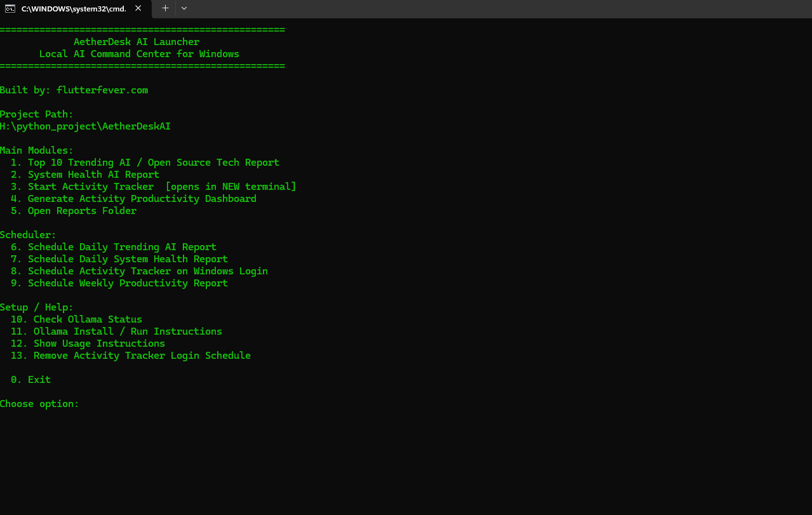
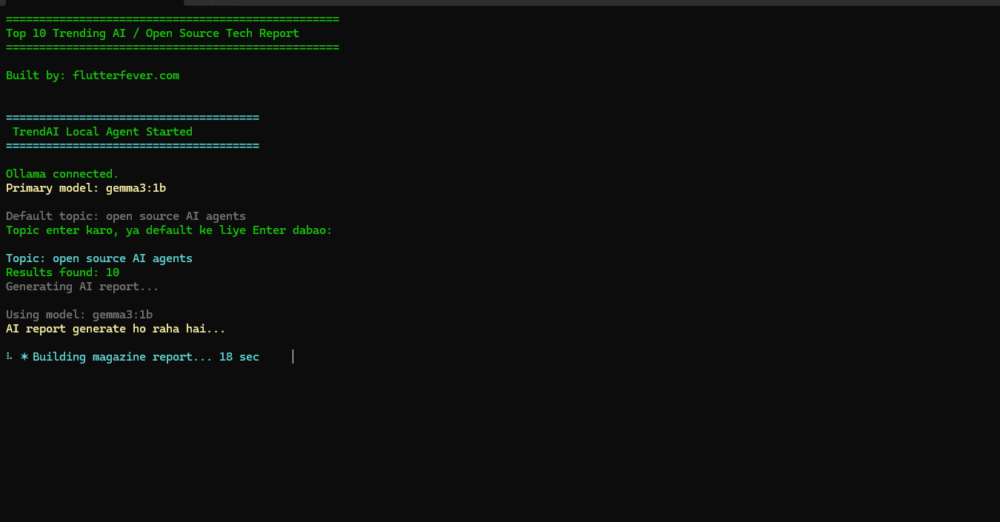
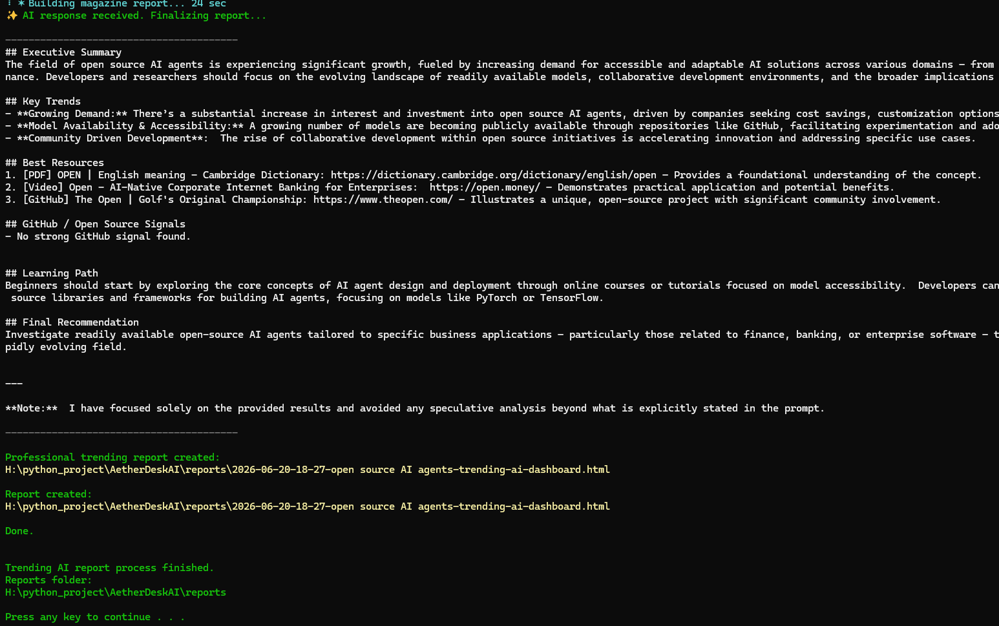
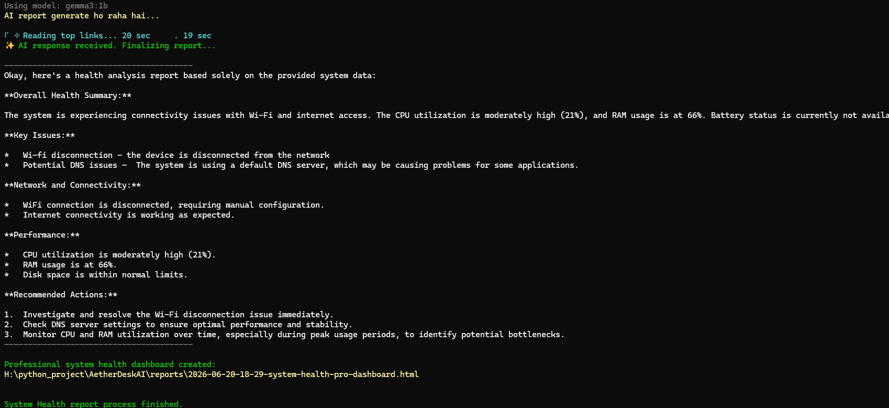
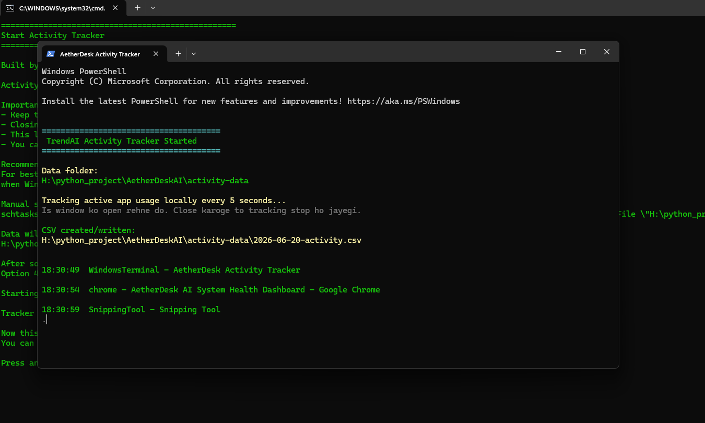
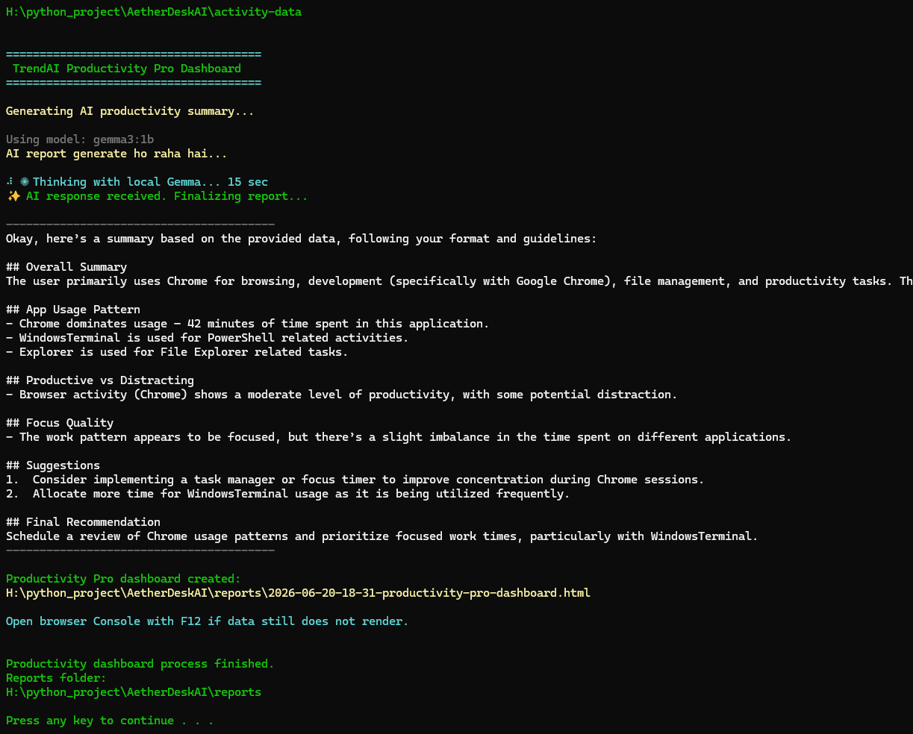
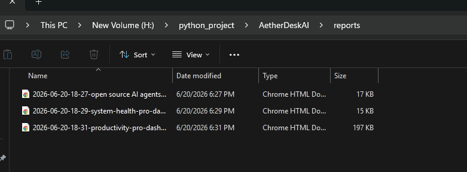
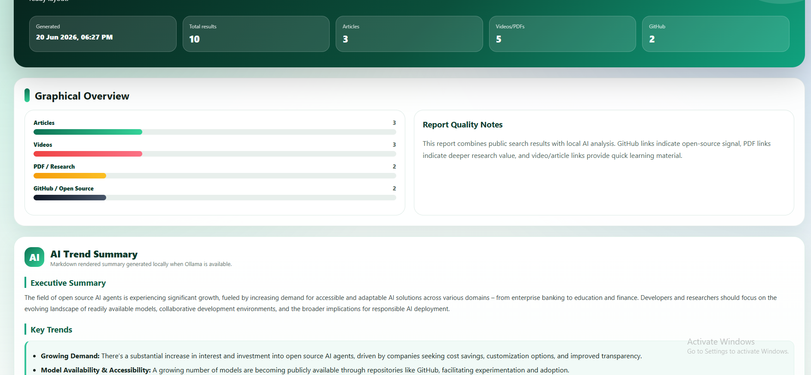

# AetherDesk AI

**AetherDesk AI** is a local-first Windows AI command center built with PowerShell, HTML reports, and optional Ollama support.

It helps you:

* Generate trending AI and open-source technology reports
* Check Windows system health
* Track active app usage
* Build productivity dashboards from local activity data
* Export clean browser-based reports

> Local AI. Local reports. Local productivity intelligence.

**Built by:** [flutterfever.com](https://flutterfever.com)

---

## Screenshots

### 1. Launcher / Main Menu



### 2. Report Flow



### 3. Dashboard View



### 4. System Health / Activity View



### 5. Productivity Report



### 6. Final Report View



### Report Output



### Summary Report



---

## Features

| Feature | Details |
| --- | --- |
| Local-first | Activity logs and reports stay on your computer |
| Ollama support | Optional local AI summaries with models like `gemma3:1b` |
| Trending reports | Generates AI/open-source technology reports |
| System health | Checks CPU, RAM, disk, Wi-Fi, Bluetooth, DNS, internet, and battery |
| Activity tracking | Tracks active Windows apps and window titles |
| Productivity dashboard | Shows app usage, category usage, time patterns, and score |
| HTML reports | Browser-based reports with PDF/print support |
| Scheduler support | Daily/weekly automation through Windows Task Scheduler |

---

## Project Modules

### Trending AI Report Agent

Generates AI and open-source technology trend reports.

```powershell
powershell -ExecutionPolicy Bypass -File .\run-agent.ps1
```

### System Health AI Agent

Creates a Windows health dashboard.

```powershell
powershell -ExecutionPolicy Bypass -File .\run-health-ai.ps1
```

### Activity Tracker and Productivity Dashboard

Tracks app usage and generates productivity reports.

```powershell
powershell -ExecutionPolicy Bypass -File .\activity-tracker.ps1
powershell -ExecutionPolicy Bypass -File .\activity-report.ps1
```

---

## Folder Structure

```text
AetherDeskAI/
├── AetherDeskAI-Launcher.bat
├── README.md
├── config.json
├── run-agent.ps1
├── run-health-ai.ps1
├── activity-tracker.ps1
├── activity-report.ps1
├── system-health.ps1
├── report.ps1
├── search.ps1
├── ollama.ps1
├── screenshots/
├── reports/
├── logs/
├── cache/
└── activity-data/
```

---

## Requirements

* Windows 10 or Windows 11
* PowerShell 5.1 or newer
* Internet connection for trending reports
* Optional: [Ollama](https://ollama.com/download) for local AI summaries

Recommended Ollama model:

```powershell
ollama pull gemma3:1b
```

---

## Quick Start

Run the launcher:

```powershell
.\AetherDeskAI-Launcher.bat
```

Or run a module manually:

```powershell
powershell -ExecutionPolicy Bypass -File .\run-agent.ps1
powershell -ExecutionPolicy Bypass -File .\run-health-ai.ps1
powershell -ExecutionPolicy Bypass -File .\activity-tracker.ps1
powershell -ExecutionPolicy Bypass -File .\activity-report.ps1
```

Generated reports are saved in:

```text
reports/
```

Activity logs are saved in:

```text
activity-data/
```

---

## Configuration

Edit `config.json`:

```json
{
  "appName": "AetherDesk AI",
  "model": "gemma3:1b",
  "topics": ["Top 10 Trending AI topic"],
  "maxResults": 10,
  "language": "English",
  "includeArticles": true,
  "includeVideos": true,
  "includePDFs": true,
  "includeGithub": true,
  "outputFolder": "reports",
  "askTopicOnRun": true
}
```

For scheduled tasks, set:

```json
"askTopicOnRun": false
```

---

## Privacy

AetherDesk AI is designed for personal, transparent, local use.

* Activity data stays local
* Reports are generated locally
* Ollama runs locally when enabled
* No cloud database is required
* Trending reports use internet sources only for public links

Do not use activity tracking to monitor another person without clear consent.

---

## Roadmap

Planned improvements:

* SQLite storage
* Better dashboard themes
* Installer script
* Desktop UI
* ETL pipeline
* Vector search over reports
* Local embeddings and RAG
* Plugin system

---

## License

Recommended license: `MIT License`
